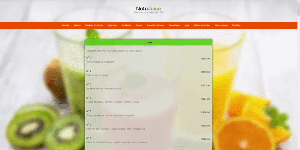
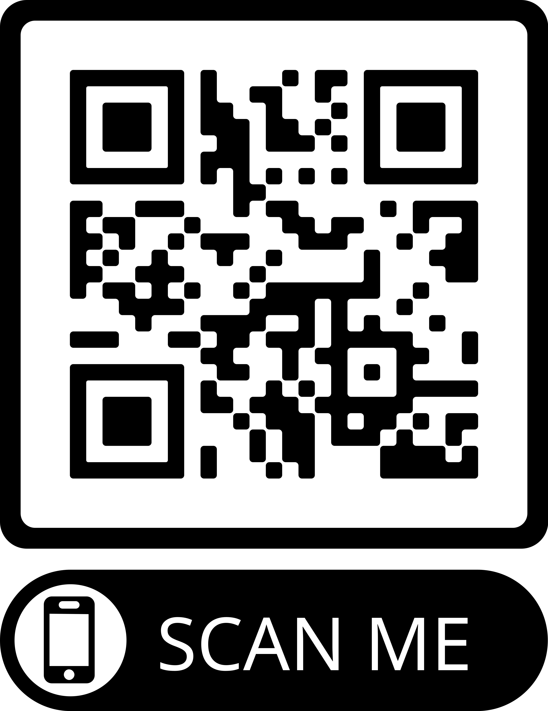

<h1 align="center" id="cardapio-natujuice"> Cardápio NatuJuice</h1>

## :memo: Descrição

O Cardápio NatuJuice é um projeto desenvolvido durante a Maratona Explorer 3.0 da RocketSeat. Com o objetivo de ser um cardápio virtual no qual os clientes podem acessar tanto pelo pelo site quanto por escaneamento do QR CODE que seria disponibilizado nas lanchonetes, cafés e/ou lanchonetes. 

## :books: Funcionalidades

* <b>Funcionalidade 1</b>: Acesso por QR CODE

 

* <b>Funcionalidade 2</b>: Apertando no Menu de Navegação, levará o cliente para a sessão escolhida. 
* <b>Funcionalidade 3</b>: Totalmente responsivo

## :wrench: Tecnologias utilizadas

* VS CODE;
* HTML;
* CSS;
* Figma;

## :dart: Status do projeto

:white_check_mark: Projeto finalizado 

## :wave: Autor

<a href="http://github.com/mariffsilva">
 

<b>mariaffsilva</b>
  
</a>
🌼
 
 

 Feito com ❤️ por Maria de Fátima. Entre em contato!
 

 
 

:arrow_up:[ Voltar ao topo](#cardapio-natujuice) 
